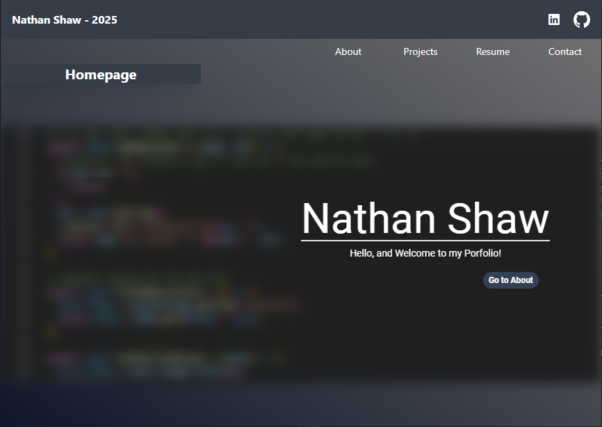
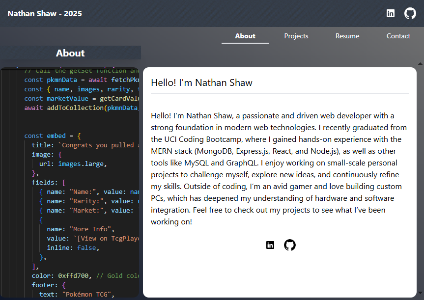
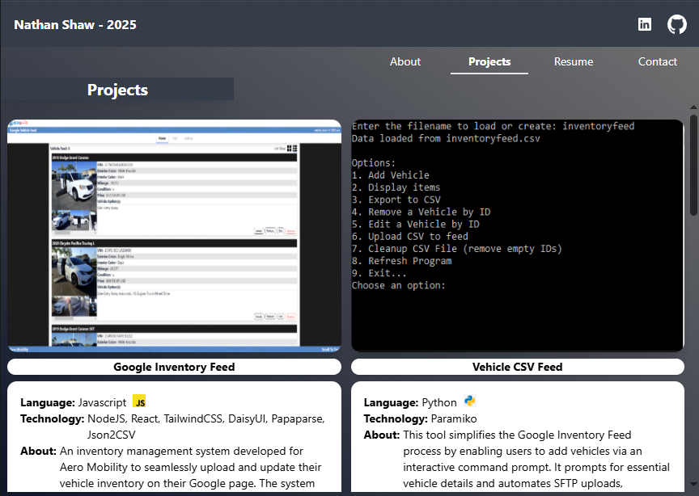
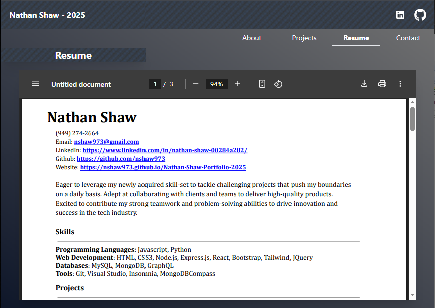
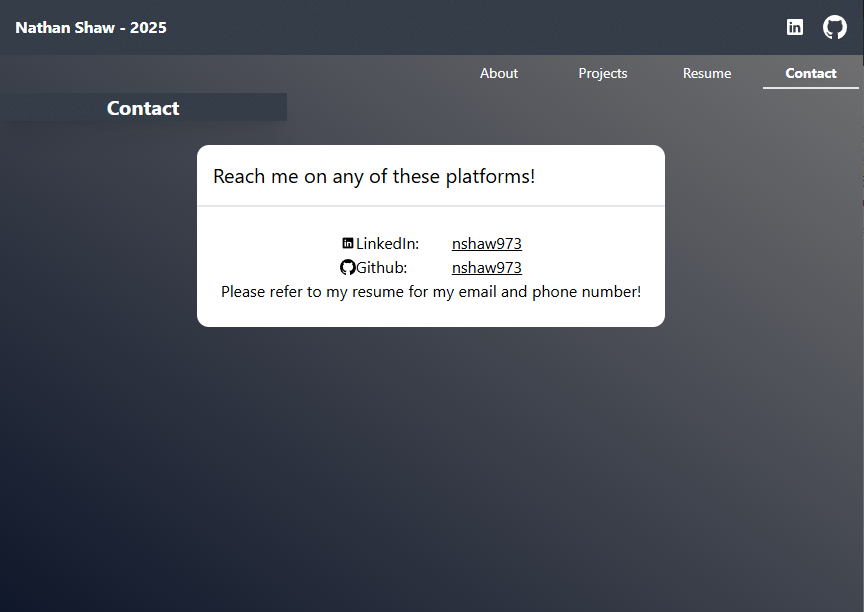

# Deployed Portfolio

[Nathan Shaw Portfolio 2025](https://nshaw973.github.io/Nathan-Shaw-Portfolio-2025/).

## Technology
- Javascript
- React
- TailwindCSS
- Tailwind-Animated
- DaisyUI
- Github Pages

## About

Demonstrate my expertise in React and Tailwind by building a sleek, responsive portfolio that highlights my projects with detailed descriptions and live links. The portfolio also features an integrated resume section, allowing visitors to view my professional experience and download it as a PDF for convenience. This project reflects my ability to combine modern web development tools to create a polished, user-friendly experience.

## Navigation

- About
    - About me
- Projects
    - Contains projects created by me, with description, and technologies used.
- Resume
    - PDF copy of my Resume that can be viewed and downloaded.
- Contact
    - Has links to my Github and LinkedIn

## Credit

Created by me (Nathan Shaw)

Github: [nshaw973](https://github.com/nshaw973)
LinkedIn: [Nathan Shaw](https://www.linkedin.com/in/nathan-shaw-00284a282/)

